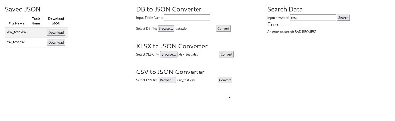

# GaruData: A Comprehensive Tool for Normalizing Leaked Databases for OSINT

*GaruData* is a powerful command-line interface (CLI) tool designed to streamline the normalization of various types of leaked databases into a unified JSON format. This tool is invaluable for Open Source Intelligence (OSINT) and red teaming activities, enabling security professionals to efficiently handle and analyze diverse data sets.

## Key Features

- *Database Normalization*: GaruData supports the normalization of a wide range of leaked databases, transforming disparate data structures into a cohesive JSON format. This ensures consistency and simplifies subsequent data processing tasks.
- *Integrated Database*: The tool consolidates the normalized data into a single, integrated database, facilitating comprehensive analysis and correlation of information across different data sets.
- *HTML CRUD Functionality*: GaruData provides a web-based interface for Create, Read, Update, and Delete (CRUD) operations on the normalized data. This feature enhances usability, allowing users to interact with the data through a user-friendly HTML interface.
- *OSINT and Red Teaming Utility*: Specifically designed for OSINT and red teaming, GaruData aids in gathering actionable intelligence from leaked databases. It enables security teams to identify patterns, track threat actors, and uncover critical insights.
- *Customizable and Extensible*: Users can customize GaruData to fit their specific needs, and the tool's extensible architecture allows for the addition of new database types and normalization rules as required.

## Use Cases

- *Threat Intelligence*: Analysts can use GaruData to aggregate and normalize data from various leaked databases, providing a comprehensive view of threat landscapes.
- *Red Team Operations*: Red team members can leverage the tool to gather and analyze data for planning and executing penetration testing and security assessments.
- *Research and Analysis*: Researchers can utilize GaruData to study data breaches, track cybercriminal activities, and develop mitigation strategies.

## Setting Up and Running GaruData

### Prerequisites

- Python 3.6 or higher installed on your machine
- Git installed on your machine

### Steps

1. **Clone the Repository**

   Open your terminal (Git Bash, Command Prompt, or PowerShell) and navigate to the directory where you want to clone the project. Then, run:
   bash
   git clone https://github.com/adnell33/GaruData.git
   cd GaruData

2. **Set Up a Virtual Environment (Optional but Recommended)**

It's good practice to use a virtual environment to manage dependencies. You can create one using venv:

```bash
python -m venv venv
```

*Activate the virtual environment:*

On Windows:
```bash
venv\Scripts\activate
```

*On macOS/Linux:*
```bash
source venv/bin/activate
```

3. **Install the Requirements**

Install the necessary dependencies by running:

```bash
pip install -r requirements.txt
```

4.**Run the Conversion Script**

*To normalize the databases and convert them to JSON, run:*

```bash
python convert_json.py
```

5.**Run the Server**

*If your project includes a server component (e.g., a Flask or FastAPI server), start the server by running:*

```bash
 python convert_json.py
```


6.*Access the Web Interface*

*Open your web browser and navigate to the URL provided by the server (usually http://127.0.0.1:5000 or similar) to access the HTML CRUD interface.*


### USER INTERFACE



